## Steps

step 1: clone the repository

for me: git clone http://AnindaMaulik@qanswer-gitlab.univ-st-etienne.fr/D063520/data2rdf.git

step 2: open the python file named: 10for70classesProblem650off700.py

step 3: find "F:" and replace that with the your file location

step 4: delete the folder named "output"

step 5: delete the contents of "test". If it doesn't exist,then create one.

step 6: delete the contents of "texts". If it doesn't exist,then create one.

step 7: create a folder named "excels".If it doesn't exist,then create one.

step 8: run this file:10for70classesProblem650off700.py

step 9: take the file named ObjectPositionOutput.nt from this directory: "data2rdf-master\target"

step 10: upload it to QAnswer

https://qanswer-frontend.univ-st-etienne.fr/user/query?kb=22june2020&user=anindamaulik
the above link is being associated to 19k images
works well

https://drive.google.com/drive/folders/1ITdXRfZa6hhCmQ8m6NNjSUOkC2S48v8y?usp=sharing
the above link contains excel, text, test images, output images for 19k images and also for 650 images


## 19k images

https://qanswer-frontend.univ-st-etienne.fr/user/query?kb=22june2020&user=anindamaulik

```the above link is being associated to 19k images works well```

https://drive.google.com/drive/folders/1ITdXRfZa6hhCmQ8m6NNjSUOkC2S48v8y?usp=sharing

```the above link contains excel, text, test images, output images for 19k images and also for 650 images```

-----------------------------------------------------------------------------------------------------------------------------------------------------------
<span class="smallcaps">UNIVERSITY OF JEAN MONNET  
</span> <span class="smallcaps">Laboratoire Hubert Curien</span>  
<span class="smallcaps">Connected Intelligence team</span>  

-----

  
<span> **Object extraction techniques and visual image search with
Semantic web techniques**</span>  

-----

  

*Submitted by:*  
Aninda <span class="smallcaps">Maulik,</span>  
CPS2

 

*Supervisor:*  
Prof. Pierre <span class="smallcaps">Maret</span>  
Dennis <span class="smallcaps">Diefenbach</span>  

  
  
  

# Introduction

The topic of this internship is about image search. Current techniques
of image search (google, bing, and others) use annotation of the images
to provide results to users. However the computer vision techniques are
not always used to index the images, and there are techniques from the
Semantic Web domain that could also improve the search, especially
advanced Question-Answering techniques based on linked data.

We will see in this report some limitations of current techniques and
our innovative approach for semantic image search based on Computer
Vision techniques, Semantic Web techniques and Question-Answering
techniques. The structure of this report is as follows : the next
section will present the current image search techniques. Then we will
proceed to describe QAnswer. Thereafter, we will talk about the research
problem and state of the art. Following this, we would discuss about our
contributions and limitations. Finally, we would conclude by displaying
some results.

# Current image search techniques

Google: give me pictures of bicycle

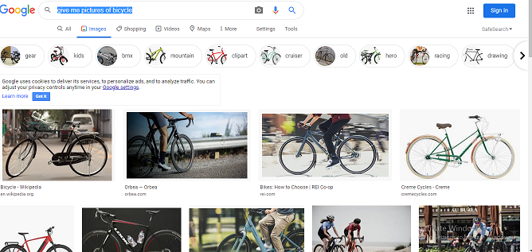

From the above, we can see that, there are just too many results.Visual
Search Engines like Google and Bing use image recognition to provide
users with the best search results.Picsearch is also a traditional
visual search engine that offers a massive image archive.Now,Image
recognition is the process of identifying and detecting an object or a
feature in a digital image or video.The modeling process for image
recognition is shown in Step 1 through 4.  


#### Convolution Neural Networks — the algorithm for image recognition

The networks in (Modeling Step 3: Train the model to be able to
categorize images) or (Modeling Step 4: Recognize (or predict) a new
image to be one of the categories) have implied the popular models are
neural networks models. Convolutional Neural Networks (CNNs or ConvNets)
have been widely applied in image classification, object detection or
image recognition.


# QAnswer

Users’ experience is an important factor for the success of a given
application. We aim to provide the best possible user’s experience by
introducing QAnswer. QAnswer is knowledge (or ontology) based QA
system.A knowledge base is a collection of facts that can be interpreted
by a machine. Such a fact can look like this:"Alan Turing" "student of"
"Alonzo Church".We have million of such facts and we use them to find an
answer to your question.

The front-end of QAnswer which highly impacts the users’ experience, is
an important part for a image base query system. QAnswer, well handles
the translation from a natural language question to correct SPARQL
queries.SPARQL has emerged as the standard RDF query language. An RDF
query language is able to retrieve and manipulate data stored in
Resource Description Framework (RDF) format. RDF data model is based on
the idea of making statements about web resources in expressions of the
form subject–predicate–object, known as triples. The subject denotes the
resource, and the predicate denotes traits or aspects of the resource,
and expresses a relationship between the subject and the object. We
generate the rdf data model from a csv file, in which each line includes
information for a triplet and all its components. The csv file is
generated by consolidating the information and details about the
required images. We primarily get the information of the required images
by running the state-of-the-art, real-time object detection system;
YOLO(You Look Only Once).

A regular search just gives you a randomly ordered list of items in
which your search term occurs. A smart search will provide you a ranked
list of items that are strongly related to the search terms you entered,
even if they do not match exactly. This means that even though some of
the results will doubtless be unrelated, and sometimes absurd, there is
a very good chance that there is data you can use pretty high up in
those results, even if you didn’t ask quite the right question. And
there may well be relevant data you didn’t even think to ask for.

Being smart in this way is a key benefit of search. Queries cannot be
smart. Queries must always give you exactly what you asked for. There
can be no tolerance for serendipity in query results. Search can be
smart, but query must be dumb and strictly obedient.

There are mainly two reasons for not getting the right query result. The
first is that we simply do not have the data to answer it. We generally
try to find the best interpretation of your question based on the data
we use. If we do not have the data also the interpretation will be
wrong. The second reason for wrong query result is that we have the data
but we are not able to correctly interpret your question.Here’s an
instance of the same. We are trying to improve over time the quality of
the QA system by adding new datasets and by refining the algorithm that
interprets your question. So hopefully next time it works.

A big advantage over traditional search engines is that different
information can be combined so that we can answer questions like ’Who
was a student of Alonzo Church?’.QA system makes a formal database
query,which is addressed in formal terms to a specific dataset.Our
underlying datasets are Wikidata and openstreetmap data. Wikidata
contains structured knowledge about many existing entities like the
European Union. It contains information about the capital is Brussel.
This information is converted into the triple"European Union" "capital"
"Brussel" allowing us to answer a question like ’What is the capital of
the EU?’.

We have an open API: curl –data "query=Who is the wife of Barack Obama"
http://QAnswer-core1.univ-st-etienne.fr/api/gerbil which support the
following parameters:query: for the questions the language supported
currently are en, fr, de, it, es, zh.Moreover, the knowledge-base that
are currently supported are dbpedia, wikidata, dblp, and freebase.  

# Presentation of the research problem

The research community has made a lot of efforts to use the computer
vision techniques for extracting knowledge from images. On the other
side, not much attention has been paid to the implementation of
innovative methods for making this knowledge available.We hope to change
this trend by Semantic Web techniques for querying the knowledge made
available by computer vision. My work focuses on bridging the two
disciplines here.

# State of the art

Let’s try to understand how does a Google image search engine work.
There are three ways in this.

1\) Indexing the text surrounding any image and matching it with the
given query. If query matches, the corresponding linked image is
retrieved. 2)Usage of object identification techniques and annotating
the images with the name of these objects. 3)Linking all visually
similar images to the image with the same text. e.g. consider an image
Img1 on any site with it’s surrounding text Txt1. And lets say there are
some other images Img2,Img3,Img4 etc. which may or may not have text but
their (visual) content matches with the contents of Img1. Now for given
query, if Txt1 is a good match, the retrieved result can contain Img1 in
addition to Img2, Img3, Img4, etc. This is just one factor in addition
to many other like matching query with text, features used to represent
an image, page-rank of page containing an image, relevance, indexed
database size available with search engine, etc. Huge indexed database
availability with Google is one of the reasons why Google can give you
best search results.

Hence, the current indexing and search techniques provide results on the
presence of a given type of object, without considering more details
such as: the relative or absolute position of the objects in the image,
the number of given objects, and other characteristics that could be
inferred from the image analysis (such as ongoing actions). An example
of this would be, if we ask for pictures of bicycle, we get many photos.
However, when we try to search for images of bicycles on the left part
of the photo, we get with the current techniques all the bicycle images
which may or may not contain a photo of a left hand sided bicycle. Thus,
we can conclude that google doesn’t index their image base, based on
object position and other characteristics from the image analysis.

In the domain of search engines on structured data, QAnswer is a recent
technology that converts the natural language into triples and use the
best ranked SPARQL query to query structured data sources. The objective
of this work is to combine the results from the image analysis processes
with the query capabilities of QAnswer in order to improve the state of
the art of image search engines.The details are explained in the
upcoming section.As discussed before, it would all start from converting
the natural language text into triples; the triples would be then
matched with an RDF file embedded within QAnswer. Thereafter, SparQL
queries would be generated to make queries over structured data sources
based on the RDF file information.

All our efforts goes to the creation of this one RDF file which makes
the difference. This RDF file gives the ability to QAnswer to improve
the state of the art in the image search engine domain.

# Contribution/Proposal description and implementation

We have implemented a 2 steps approach that first identifies objects
into images, and then generates the topological semantic description of
the scene in the picture.

  - Implementation of an Algorithm for object extraction.

  - Design of a semantic web modelling for extracted data.

  - Implementation of a visual image search engine through QAnswer.

Let’s discuss each part separately.

## Implementation of an Algorithm for object extraction.

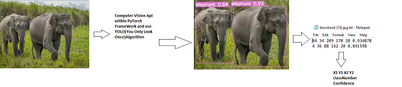

  
We initiate our work over a desired image base which could random
downloaded set, structured data like wikimedia or specialised wikimedia
api. After choosing a set of images, we select the state-of-the-art
computer vision api(Yolo-You Only Look Once) with a pre-trained
model,within PyTorch Framework, to detect objects in our image. Now, our
favourite computer vision api YOLO, is able to identify 80 classes of
objects, here’s a list:

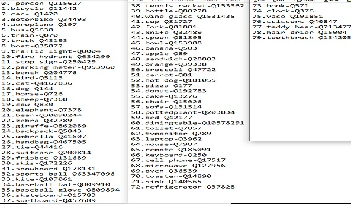

The above list contains the class number, class name and also QID. We
can find the same information in this url, without the QID. The link
is:  
https://github.com/pjreddie/darknet/blob/master/data/coco.names  
We introduce a dataset of images to our YOLO program. YOLO gives a
corresponding text files, containing the co-ordinates of bounding
box(X1,Y1,X2,Y2), class number or class name,confidence percentage with
which it detects an object in those images. It also returns all the
images along with bounding box marked around every object, which YOLO
has identified.Then we try to use the bounding box co-ordinates to
understand the following.

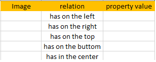

  
We would try to explain the algorithm used for each of them.

\(has on the left
\gets object\) \(has on the right\gets object\)

\(has on the top
\gets object\) \(has on the bottom\gets object\)

\(has in the center \gets object\)

We would want to explain X-Image Dimentions,Y-Image Dimentions refer to
the breadth and length respectively. Moreover, we calculate the X-centre
and Y-centre as follows:  
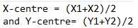  
After implementation of object extraction and determining the object
position within images, we create a csv file containing these details.


Finally, we try to build a sematic web model.

## Design of a semantic web modelling for extracted data.

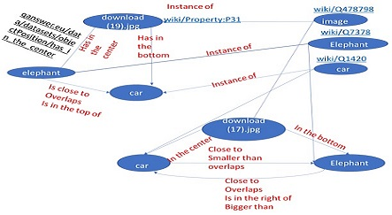

The Semantic Web is not a separate Web but an extension of the current
one, in which information is given well-defined meaning, better enabling
computers and people to work in cooperation. The first steps in weaving
the Semantic Web into the structure of the existing Web are already
under way. In the near future, these developments will usher in
significant new functionality as machines become much better able to
process and "understand" the data that they merely display at present.  
Let’s talk a little bit about triples in semantic web.  
Triples

  - Subject could be URI or blank node

  - Predicate could be URI, but never be a blank node

  - Object could be URI, blank node or literal

Now, let’s try to define the important terms that has been just
mentioned.

  - URI
    
    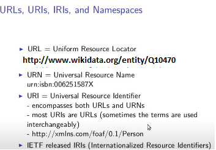

  - blank node- In RDF, a blank node (also called bnode) is a node in an
    RDF graph representing a resource for which a URI or literal is not
    given.The resource represented by a blank node is also called an
    anonymous resource.  
    
    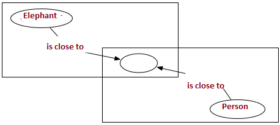

If, we refer again to the csv file which is shown in Figure 10, the
image names are subjects; the relations such as "has on the
left/right/top/bottom/center" are predicates; and objects are object
names that has been mentioned under the relations. The csv file that has
been referred to, is based on Image-Object Relation. We use a Java
program to convert this csv file into a RDF file, by taking the
subject-predicate-object into consideration. Here’s a glimpse of an RDF
file.


## Results

Finally,let’s try to query on the QAnswer using the api, that has been
discussed above for airplane-Q197. Here’s a snapshot of the first 8
images.


Let’s try to query some more, but this time, we would like to query for
bicycles in the right.


Here’s a small set of images, consisting of bicycles.

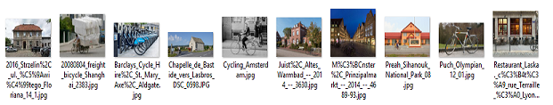

So, we can see that, out of 10 pictures of bicycles; only 3 where chosen
which fits the query of bicycles in the center

We would now like to demo for images in the left. Here’s an URL:
<https://qanswer-frontend.univ-st-etienne.fr/qa/full?query=train%20in%20the%20left&tags=%5B%5D&lang=en&kb=onto&user=anindamaulik>

You can just visit the homepage of QAnswer by click on the above
hyperlink and type in "train in the left". You will get an image of a
train on the left of the photo. You can go ahead to try it, right now.

Query for bench in the bottom.So, we look closely and locate a bench at
the bottom of the picture.

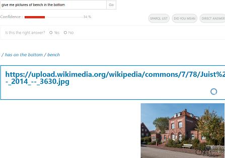

## Application to wikimediacommons images

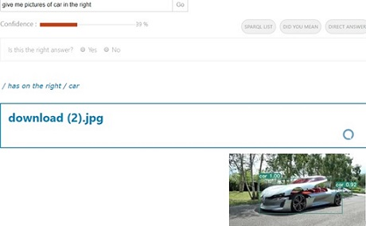

We began our work, by downloading a very small set of images. Now, from
this very small set, QAnswer was able to find successfully that one
picture which has a car on the right. On the first glance, it seems that
there’s a car in the center but if we look closely then we can see that
there’s indeed another car on the right side of the image.  
Since, the initial work was based on a very small random dataset, hence
we decided to work on a significantly larger structured dataset. The
first option that seemed fair at the time was Wikimedia which contains
more than a million images. But, we wanted to broaden our area of work
by including images and human hand annotated structured data.Hence we
chose to work on a particular wikimedia api. The api is:
https://commons.wikimedia.org/w/api.php?  
action=query\&list=search\&srsearch=haswbstatement:P180=Q7378  
\&srnamespace=6\&format=json ..With this api, we are querying for images
with QID: Q7378, which is the QID of an elephant. If, we just copy and
paste this api in our browser, we’ll get a json containing the
information about 10 images of elephant. In the api, mentioned we can
add a parameter srlimit=500, and if we paste this new url:  
https://commons.wikimedia.org/w/api.php?  
action=query\&list=search\&srsearch=haswbstatement:P180=Q7378  
\&srnamespace=6\&srlimit=500\&format=json in our browser then we can get
json data of 500 images, given that it is available in the api. Please
note that the new parameter introduced,srlimit, has a default value of
10 and hence we pasted the url without this parameter we got json data
for 10 images. There are many such parameters like this and the details
of these parameter can be found in the documentation under this link:
https://www.mediawiki.org/wiki/API:Search . Let’s talk about the QID:
Q7378, which is the QID of an elephant, for a moment. We get the json
data of 227 images of elephant in one go by using the api containing the
additional parameter,srlimit=500, mentioned above. Now, a different
scenario arises, where the json data availability is more than 500 like
in the case of QID:Q1420-car, then we can use a while loop and iterate
over the parameter sroffset.

## Automation pipeline

We decided to automate the entire process, starting from downloading the
images from wikimediacommons api, containing hand-annotated structured
data.Then, YOLO runs over this downloaded data, giving out text files
and images with bounding boxes around the detected objects. Following
this, a csv file containing Image-Object relation comes into existence.
Therafter, a java program is triggerred which has a sole purpose of
converting the csv file to rdf file. Finally, we have a rdf file, ready
to uploaded to QAnswer for queries on object position.

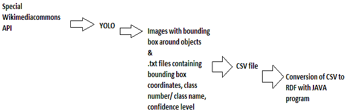

# Limitations and future work

## Query for images on the top

### Issue with confidence of detection by YOLO

Query for clock in the top.So, we look closely and not able locate a
clock at the top or anywhere

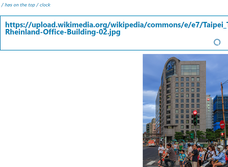

We are trying to understand that what just happened here. In order to
get a bit of an insight, let’s try to check the photo with bounding box
by YOLO.

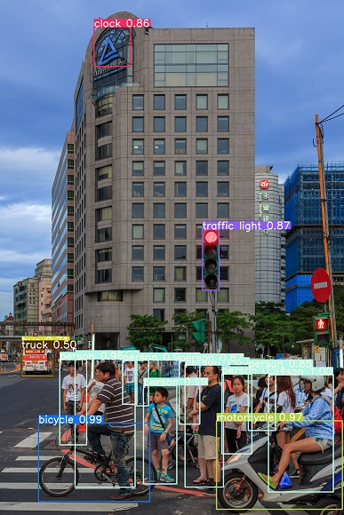

So we see that YOLO has detected a clock with a confidence of 86
percent, when there is just a sign and not a clock. We could have
increased the confidence level higher that 86, in order to avoid this
error. But this error, could have also come up for a confidence above
90. Therefore such errors just cannot be avoided.

### Issue with the object name assigned by YOLO

Query for a traffic light in the top. If we check the query in QAnswer,
traffic light has become traffic. This is not a fault of QAnswer.
Infact, QAnswer is able to find the closest word to traffic light in the
uploaded rdf file, and give us the result. The reason, we have traffic
in the query is because YOLO identifies traffic light as traffic.

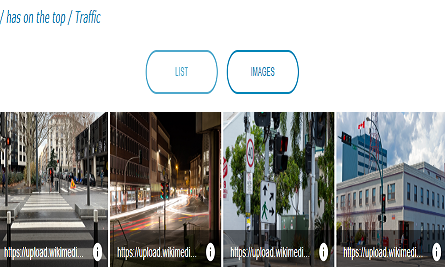

## Object-Object Relations

Let us to understand Object-Object Relation which is an attempt to
establish the relationship between two objects in an image. Eg: car is
on the left of a person in the image1. Here, "car is on the left of a
person" is a triplet and this triplet becomes the subject of the second
triplet, followed by the predicate-"in" and object-"image1". Such kind
of triplets are called reified triplets. This features is still not
available in QAnswer. Here’s a glimpse of what would we get if we try to
query a reified triple.  

.jpg)

  
So, as we see from the figure, QAnswer is not able to query in form of
reified triples.  
Our algorithms are ready for future use in regards to Object-Object
relation. We would like to present the algorithms for the following
Object-Object Relations.  

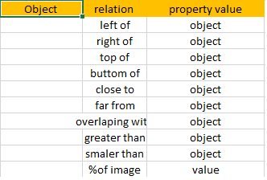

We would begin with presenting our algorithm for an object to find out,
if it is to the left or right of the second object  

\(Object_1 Is On The Left
\gets Object_2\) \(Object_1 Is On The Right
\gets Object_2\)

  
We would continue with presenting our algorithm for an object to find
out, if it is on the top or bottom of the second object  

\(Object_1 Is On The Top
\gets Object_2\) \(Object_1 Is On The Bottom
\gets Object_2\)

  
Following this, here we are presenting our algorithm for an object to
find out, if it is close or far from the second object  

\(Object_1 Is Close To
\gets Object_2\) \(Object_1 Is Far From
\gets Object_2\)

Thereafter, here we are presenting our algorithm for an object to find
out, if it is smaller or greater than the second object

\(Object_1 Is Smaller Than
\gets Object_2\) \(Object_1 Is Greater Than
\gets Object_2\)

  
Now, we would take into account a scenario to find out the percentage
occupancy of an object in a picture. We try to find the percentage by
multiplying 100 to the ratio of the area of the object and the
picture.  
Finally, we want to conclude by explaining our way of finding out if an
object overlaps another object; in other words, we are trying to find
out if one object’s bounding box overlaps the other.  
Let’s introduce ourselves to a spatial data model which is accompanied
by a natural language relationships between geometric objects –
intersects-and a theoretical framework for understanding that using the
3x3 matrix of the mutual intersections of their component point sets.The
following code shows how you can test for intersection:  

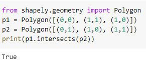

## QAnswer

### Not getting the right query result

As mentioned in the QAnswer section, there can two reasons for not
getting the right query result. The first is that we simply do not have
the data to answer it. We generally try to find the best interpretation
of your question based on the data we use. If we do not have the data
also the interpretation will be wrong.


The second reason for wrong query result is that we have the data but we
are not able to correctly interpret your question.Here’s an instance of
the same.

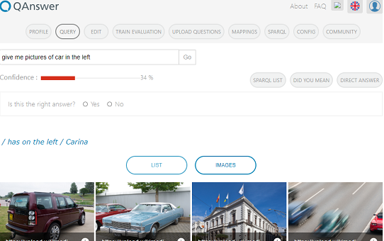

### Handling reified triples

QAnswer team is working on handling reified data, that has been
discussed in the above section, so that we could answer question related
to object to object relations into the images.

## RDF data from wikimediacommons api

The wiki media API which we chose to work with to get images from wiki
media commons, can be used to retrieve human annotated structured data.
We’re currently working on using the structured data. Here’s the API for
getting RDF data for images containing objects annotated as "elephant"
which is coded Q7378.: <https://commons.wikimedia.org/w/api.php?
action=querylist=searchsrsearch=haswbstatement:P180=Q7378
srnamespace=6format=json>

## Usage by others

Our technique can be included into search engines for better results We
can also improve on computer vision techniques to identify more objects
and we can also introduce the identification of background scenes.

# Conclusion

we have worked on improving image search engines by combining Computer
Vision techniques with Semantic Web techniques and Question Answering
techniques. Computer Vision techniques is able to identify objects into
images, and Semantic Web techniques give a semantic representation of
the images that can be queried with QA engine, namely QAnswer.

QAnswer was not able to answer questions about image content. Now, we
have an automated Python program in place which takes the special
wikimedia api to download images, runs YOLO over it, creates a
Image-Object relation based csv file and then converts the same into a
RDF file which gets readily available for QAnswer’s use.

This work can be easily used by any search or query engine to give
results based on image-object relation and in a near future on
object-object relation.
